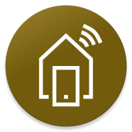

# Create Debugging Certificate
The app requires a certificate for client authentication. This document describes the steps to take in order to create such a certificate for debugging purposes.

###### Table of Contents
1. [Create Certificate](#create-certificate)
2. [Export Certificate from Certificate Store](#export-certificate-from-certificate-store)

<br/>

## Create Certificate
On Windows, create a new certificate by executing the following command within a terminal:
```bat
New-SelfSignedCertificate -CertStoreLocation "Desktop" -DnsName "smarthome.christian2003.de" -FriendlyName "TestCertificateForSmarthomeWebsite" -NotAfter (Get-Date).AddYears(10)
```

This will create a new certificate which will be stored within the Windows certificate store.

<br/>

## Export Certificate from Certificate Store
After [creating a certificate](#create-certificate), the certificate needs to be exported.

###### Open the Windows Certificate Store
Open the Windows certificate store by executing the following command within a terminal:
```bat
certlm.msc
```

Afterwards, locate the certificate created at **Personal > Certificates**:


###### Export the Certificate
Right click the certificate and click on **All Tasks > Export**. This opens the certificate export wizard. Click "Next" within the first window.

Within the next window, export the private key of the certificate by selecting the option **Yes, eyport the private key** and click "Next".

Keep app settings within the next window and click "Next" again.

Within the next window, enter and confirm a password. You need this password when installing the certificate into the Smart Home app. Click "Next" to export the certificate.
