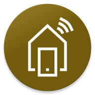

# Start Desktop Head Unit
This document describes the steps to take in order to start the desktop head unit (HDU) in order to test an Android Auto app.

###### Table of Contents
1. [Prepare Physical Android Device](#prepare-physical-android-device)
2. [Debug Android Auto App](#debug-android-auto-app)
3. [Automate HDU Startup With Shell Script](#automate-hdu-startup-with-shell-script)

<br/>

## Prepare Physical Android Device
In order to debug for Android Auto, the app must be installed to a physical device. Using an Android Virtual Device (AVD) will not work. Setting up a physical device for debugging is straightforward.

First, activate **developer settings** on the physical device. In order to do so, go to _Settings > ABout_ and click on the system build number five to seven times. Afterwards, the developer settings are activated.

Next, go to the developer settings and enable **USB Debugging**.

Next, start the **Android Auto** app on the physical device. Depending on the manufacturer, the app is either available as a part of the device's settings or as separate app.

Within the Android Auto app, enable the **Android Auto developer settings** by clicking on the app version number five to seven times. Afterwards, the developer settings for the Android Auto app are active.

This concludes all steps required for the first time setting up the physical device.

<br/>

## Debug Android Auto App
In order to debug an Android Auto app, connect your physical device to the development PC using a USB cable.

Next, start the Android Auto app on your device and go to the app settings by clicking the settings-icon in the top right corner. This opens a dropdown menu. Within the dropdown menu, click **Start sever for infotainment system**.

Afterwards, go the SDK location on your development PC and locate the **platform-tools** directory (e.g. `C:\Users\<user>\AppData\Local\Android\Sdk\platform-tools`). Open a terminal within this directory and execute the following to commands:
```bat
adb devices
adb forward tcp:5277 tcp:5277
```

Next, locate the directoy in which the DHU is located (e.g. `C:\Users\<user>\AppData\Local\Android\Sdk\extras\google\auto`) and execute the **desktop-head-unit.exe**-file.

This will start the HDU, which will automatically connect to your physical Android device.

<br/>

## Automate HDU Startup With Shell Script
In order to simplify the startup of the HDU, the following script can be used:

```bat
REM Remember to replace the paths to the 'platform-tools' and the 'desktop-head-unit.exe'
REM with the paths on your local machine!
@echo on
cd "C:\Users\<user>\AppData\Local\Android\Sdk\platform-tools"
adb devices
adb forward tcp:5277 tcp:5277
start "" C:\Users\<user>\AppData\Local\Android\Sdk\extras\google\auto\desktop-head-unit.exe
pause
```

Put the code into a bat-file (e.g. `start-hdu.bat`) and execute the script by double-clicking the bat-file.
